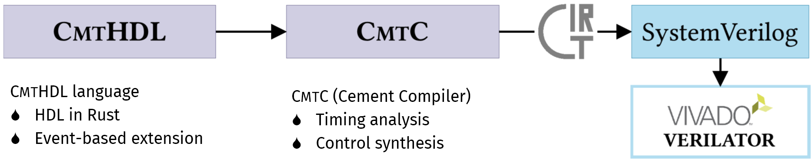

# Cement: Streamlining FPGA Hardware Design with Cycle-Deterministic eHDL and Synthesis

Cement is a hardware design framework, which encompasses the embedded HDL (eHDL), CmtHDL and the compiler, CmtC, providing a better programming framework for FPGA.
CmtHDL introduces event-based procedural specification alongside RTL description, empowering designers to describe hardware productively at a higher level of abstraction while maintaining cycle-deterministic behavior.
CmtC provides a comprehensive compilation workflow that includes analyzing the timing behavior of the hardware and conducting synthesis to yield solutions with anticipated performance for FPGAs.



<!--  -->

## File Structure

```plain
|- Cement (Root of the repo)
  |- cement
    |- src
      |- hcl: CMTHDL's embedding
      |- compiler: CMTC's frontend
      |- gir: ir and passses for new-version state-tree-based control synthesis (WIP)
      |- std: basic primitives (WIP)
      |- simulator: pure-Rust simulator (WIP)
  |- cement_macros: macros for CMTHDL
  |- cement_examples: examples
  |- tgraph: graph representation and manipulation for control synthesis
  |- irony (also named ir-rs): CMTC backend
    |- irony: ir framework
    |- irony-cmt: ops and passes for CMTC
```

## Usage

### Setup

First, clone the repo.

```bash
git clone git@github.com:pku-liang/Cement.git
```

Then, initialize the submodules: `irony` for IR and passes, `tgraph` for control synthesis.

```bash
git submodule update --init
```

Now, use Cement by adding it as a dependency in your `Cargo.toml` as the `cement_examples` does.

```toml
[dependencies]
cmt = { path = <path-to-cement-directory> }
```

### Examples

We provide examples under `cement_examples/tsc/tests`;

For example, `cement_examples/src/tests/basics.rs` contains a `Pass::pass_m` module and a `TopPass::top_m` module, where `Pass` and `TopPass` are types for module interfaces.

<details>
  <summary>Click to expand/collapse</summary>

```rust
#[interface(Default)]
pub struct Pass {
  pub i: B<8>,
  pub o: Flip<B<8>>,
}

module! { Pass =>
    pass_m(module) {
        module.o %= module.i;
    }
}

#[interface(Default)]
pub(crate) struct TopPass {
  pass: Pass,
  i: B<8>,
  o: Flip<B<8>>,
}

module! { TopPass =>
    top_m(module) {
        let pass = instance!(pass_m(Pass::default()));
        let pass1 = instance!(pass_m(Pass::default()));
        module.pass %= pass;
        pass1.i %= module.i;
        module.o %= pass1.o + 1.lit(B8);
    }
}

#[test]
pub fn test_top_pass() -> Result<(), ()> {
  let mut c = Cmtc::new(CmtcConfig::default());
  TopPass::default().top_m(&mut c);
  c.print();
}
```

</details>

Then the test function `test_top_pass` print the produced CIRCT IR. The function can be run by the following command:

```bash
cargo test --package cement_examples --bin cement_examples -- tests::basics::test_top_pass  --exact --nocapture
```

If you want to look at the produced SystemVerilog, see `cement_examples/src/tests/file_sys.rs`, and run:

```bash
cargo test --package cement_examples --bin cement_examples -- tests::file_sys::test_fs --exact --nocapture 
```

## Ongoing

The following features are under **RECONSTRUCTION**, and we will make them available as soon as they get ready:

<details>
  <summary>Click to expand/collapse</summary>

- [ ] Control synthesis: working on a new control synthesis implementation based on the `tgraph` library.
- [ ] Exernal IPs or Verilog import
- [ ] Improve timing analysis
</details>

The reasons for the reconstruction include:  

- The deprecated adhoc control synthesis implementation fails to guarentee the absense of extra cycles for some cases (especially for `while` loops) as required by the deterministic timing. We're working on a new implementation based on the `tgraph` library to resolve the issue and provide a more general and efficient control synthesis solution.
- The deprecated timing analysis fails to consider default values for wires and the reset situation, both of which are common cases in real-world designs. Besides, the `sc` functions are sets of enumerated cycles (too many!) for static analysis, and dynamic analysis generates too many assertions. We're working on an improved solution to cover the ignored cases and reduce analysis complexity.

We are also working on a Rust-based simulator (under cement/src/simulator) for CMTHDL designs.

## Future Work

Any suggestions or discussions are welcomed. Please feel free to open an issue or contact us.

## Paper

If you find this project useful in your research, please cite our paper that has been recently accepted to FPGA 2024:

```plain
@inproceedings{xiao2024cement,
  title={Cement: Streamlining FPGA Hardware Design with Cycle-Deterministic eHDL and Synthesis},
  author={Xiao, Youwei and Luo, Zizhang and Zhou, Kexing and Liang, Yun},
  booktitle={Proceedings of the 2024 ACM/SIGDA International Symposium on Field Programmable Gate Arrays (FPGA '24)},
  year={2024},
  address={Monterey, CA, USA},
  doi={10.1145/3626202.363756},
}
```
