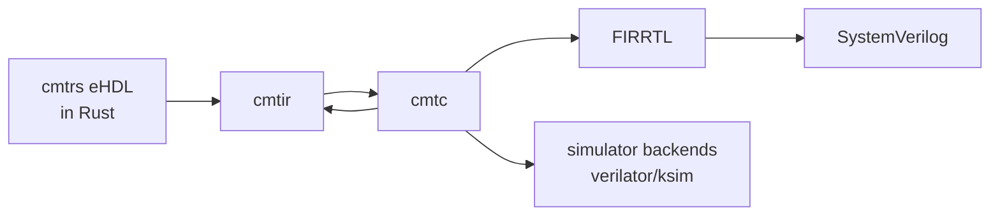

# Cement: The Next-gen Language & Compiler Powering Efficient Hardware Design

## Introduction

Cement (now referred to as `cmt2`!) represents an innovative framework that endows users with a wealth of language capabilities and compiler functionalities, all geared towards facilitating efficient hardware design. 

Since the release of its predecessor, the now-outdated [`cmt1` at FPGA'24](https://dl.acm.org/doi/10.1145/3626202.3637561), Cement has undergone a significant and comprehensive redesign. Building upon `cmt1`'s remarkable **event-based procedural specification** attribute, which empowered designers to delineate hardware control logic (e.g., generate FSMs) at an abstraction level that resembled software yet maintained cycle-determinism, `cmt2` takes a leap forward. It adopts a **rule-based** hardware description methodology, much like [Bluespec SystemVerilog (BSV)](https://github.com/B-Lang-org/bsc), thereby proffering straightforward and precise semantics for characterizing hardware behavior. This seamless integration of features equips `cmt2` to offer a hardware design journey that is not only more adaptable, modular, and responsive but also shields designers from the intricate web of connecting Register Transfer Level (RTL) hardware components. 

Moreover, `cmt2` presents a revamped Rust-based **embedded HDL** frontend, enhancing user experience with its enhanced intuitiveness. `cmt2` is engineered to generate top-notch SystemVerilog code by leveraging the [FIRRTL](https://bar.eecs.berkeley.edu/projects/firrtl.html) Intermediate Representation (IR) and the [firtool](https://github.com/llvm/circt/releases) compiler, and it extends its compatibility to multiple simulator backends, notably [Verilator](https://www.veripool.org/verilator/) and [Khronos](https://github.com/pku-liang/ksim).

### Terminology

In this project, different terms are used to refer to specific components:
- `Cement`: This term represents the entire framework, which includes the language and compiler tools. It provides the foundation and overall structure where other elements function.
  - `cmt1`: The [FPGA'24](https://dl.acm.org/doi/10.1145/3626202.3637561)-published version (archived at [`cmt1` branch](https://github.com/pku-liang/Cement/tree/cmt1))
  - `cmt2`: The current, **rule-based** version.

Within the `cmt2` framework in particular:
  - `cmtrs`: Signifies the front-end language. It is a Rust-based embedded HDL!
  - `cmtir`: Represents the intermediate representation (IR) at the central position of the whole framework. It enables diverse optimization and transformation activities.
  - `cmtc`: Stands for the compiler. It is based on `cmtir` and generates diverse backends, including FIRRTL, SystemVerilog, and simulator workspaces.


### Overview


```mermaid
graph LR;
    A[cmtrs eHDL
    in Rust] --> B[cmtir]
    B --> C[cmtc] --> B
    C --> D[FIRRTL] --> F[SystemVerilog] 
    C --> E[simulator backends
    verilator/ksim]
```

## Usage

### Setup


`cmt2` itself is a Rust crate. You can build it by:
```bash
git clone -b cmt2 git@github.com:pku-liang/Cement.git cmt2
cd cmt2
git submodule update --init --recursive
cargo build
```

`cmt2` depends on `firtool` for SV generation. `firtool-1.86.0` is tested. You can download it by:
```bash
wget https://github.com/llvm/circt/releases/download/firtool-1.86.0/firrtl-bin-linux-x64.tar.gz
tar -xvf firrtl-bin-linux-x64.tar.gz
cp -rf ./firtool-1.86.0/* <INSTALL_DIR>
```
Make sure `<INSTALL_DIR>/bin` is in your PATH.

If you want to simulate `cmt2` designs, you need to install [Verilator](https://www.veripool.org/verilator/) or [Khronos](https://github.com/pku-liang/ksim/tree/aspdac24-tutorial), depending on your preference.

> [!NOTE]
> For `ksim`, you need to rename the built `firtool` to `firtool-ksim`, `llc` to `llc-ksim`, and put them as well as `ksim` in your PATH.


### Example

Look at `crates/cmtc/examples/`.


For `GEMM`, you can run `cargo run --example gemm` to see the generated SV code `gemm.sv` and the simulator workspace `tb/gemm_ksim`.


## Components

### Crates

- `cmtrs`: The Rust-based embedded HDL frontend for `cmt2`.
- `cmtrs_macros`: The macros for `cmtrs`.
- `cmtir`: The Intermediate Representation (IR) for `cmt2`. **RULE-BASED!**
- `cmtc`: The compiler for `cmtir`, generating FIRRTL and simulators.
- `kir`: Parse, print, and def/use support for `cmtir`.


### File structure

```
cmt2/
├── crates/
│   ├── cmtrs/
│   ├── cmtrs_macros/
│   ├── cmtir/
│   ├── cmtc/
│   ├── kir/
├── README.md
├── LICENSE
```

## Publications


If you find this project useful in your research, please cite our paper that has been recently accepted to FPGA 2024:

```plain
@inproceedings{xiao2024cement,
  title={Cement: Streamlining FPGA Hardware Design with Cycle-Deterministic eHDL and Synthesis},
  author={Xiao, Youwei and Luo, Zizhang and Zhou, Kexing and Liang, Yun},
  booktitle={Proceedings of the 2024 ACM/SIGDA International Symposium on Field Programmable Gate Arrays (FPGA '24)},
  year={2024},
  address={Monterey, CA, USA},
  doi={10.1145/3626202.363756},
}
```

> [!NOTE]
> `cmt2` has undergone a significant redesign since the publication of the FPGA'24 paper. The current version is **rule-based**!


## For Chisel Experts/Fans

If you enjoy Chisel's mature ecosystem and community, feel free to try our archieved Chisel-based version [`Handle`](https://github.com/arch-of-shadow/Handle).

