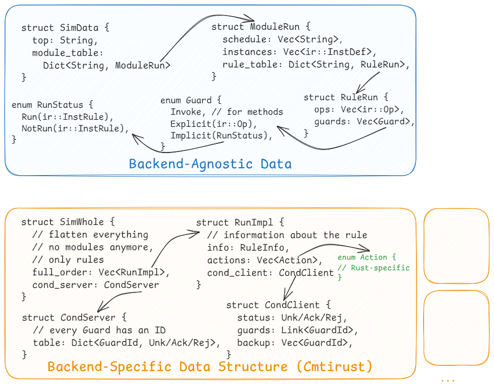
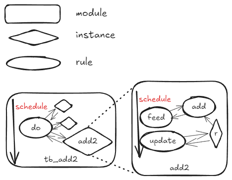

# cmtsim

This is the simulation crate for cmtir.

Its goal is not to be a single simulator, but a framework that yields **multiple** simulator backends from cmtir.

The possible backends include:

- [x] [verilator](https://www.veripool.org/verilator/): since we have `cmtir-to-sv`, here cmtsim only needs to generate verilator's testbenches.
- [x] firrtl-based simulator: either ksim or arcilator
- [x] cmtirust: `cmtir-to-rust`.


## Testbench

In cmtir, modules contains rules. And we use modules annotated with `is_tb` for testbench declaration.

```cmtir
circuit "tb_add2" () (
  (module "tb_add2" (
    (annotations {
      "is_top"  :  "true",
      "is_tb"  :  "true"
    })
    // ...
  ))
  // ...
)
```

## Design

### Interface

Multiple backends share the same interface, which should be defined in [`interface.rs`](./src/interface.rs).


### Backend

For a specific simulator backend, we need to implement the `SimItfc` trait, as shown in [`cmtirust`](./src/cmtirust.rs). Since `cmtirust` is a self-contained simulator, it must use almost all the features in `SimItfc`. But for other backends like verilator, we only need to implement the parts that are not hardware (only testbench-related).



## Semantics

It's essential to understand the semantics of cmtir, especially the rules and schedule, to build correct simulators:




The `tb_add2` module is illustrated above. We'll use this example to explain the semantics of cmtir.

There are two modules illustrated in the figure: `tb_add2` and `add2`. Every module has a "schedule", a total order of "always rules" and "public method rules". For example, the schedule of `add2` is `[feed, update]`, where `feed` is a public method rule and `update` is an always rule. The `add` is a private method rule of `add2`, and it's not in the schedule of `add2`.


For every module or its instance, its execution must observe the schedule. That is, its in-schedule rules must be executed in order. Meanwhile, a module and its instances are scheduled independently and are executed in parallel. For example, when `tb_add2` runs, its instance `add2` and others (not shown in the figure) are executed concurrently, and there are communication betweene them! 

Look at the instance `add2`, it must run `feed` first, but `feed` is a public method rule, so whether it is executed or skipped depends on whether it is invoked. So `add2`'s execution is stalled to wait for `feed`'s invocation by `tb_add2`. Back to `tb_add2`, when `do` invokes `feed`, it needs to wait for `feed`'s output value to go on, so it stalls to wait for `feed`'s output value. Now `add2`'s `feed` should start execution (since it receives the invocation), and after doing its job, it returns value to `tb_add2`'s `do` to awake it. Then `add2` continues to run `update`, since it is an always rule and it doesn't need to wait for any invocation.
